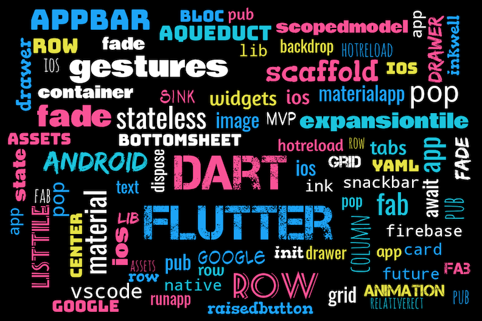

# Flutter Google Maps APP



### Show some :heart: and star the repo to support the project


A new Flutter project.

## Getting Started

### Flutter Project

* Add this to your package's pubspec.yaml file:

  `dependencies: map_view: "^0.0.12"`

## Getting Started

### Generate your API Key
 
1. Go to: https://console.developers.google.com/
2. Enable `Google Maps Android API`
3. Enable `Google Maps SDK for iOS`
4. Under `Credentials`, choose `Create Credential`. 
   - Note: For development, you can create an unrestricted API key that can be used on both iOS & Android. 
   For production it is highly recommended that you restrict. 

- More detailed instructions for Android can be found here: https://developers.google.com/maps/documentation/android-api/signup
- More detailed instructions for iOS can be found here: https://developers.google.com/maps/documentation/ios-sdk/get-api-key
 
 The way you register your API key on iOS vs Android is different. Make sure to read the next sections carefully.
 
### iOS
#### The maps plugin will request your users location when needed. iOS requires that you explain this usage in the Info.plist file
 1.  Set the NSLocationWhenInUseUsageDescription in `ios/Runner/Info.plist`. Example:
```xml
    <key>NSLocationWhenInUseUsageDescription</key>
    <string>Using location to display on a map</string>
```
    
 2. Prior to using the Map plugin, you must call MapView.setApiKey(String apiKey). Example:
```dart
   import 'package:map_view/map_view.dart';
   
   void main() {
     MapView.setApiKey("<your_api_key>");
     runApp(new MyApp());
   }
``` 
 
 ***Note***: If your iOS and Android API key are different, be sure to use your iOS API key here.
 
 3. Add code to show the MapView.  
    ```dart
    //Create an instance variable for the mapView
    var _mapView = new MapView();
    
    
    //Add a method to call to show the map.
    void showMap() {
        _mapView.show(new MapOptions(showUserLocation: true));
    }
      
    
    ```  
    
  4. Run your application on an iOS device or simulator. 
  Confirm that when you display the map you see map detail. 
  If you only see a beige screen it's possible that your API key is incorrect. When your API 
  key is incorrect you'll see messages like this in the console:
  
  ```text
  ClientParametersRequest failed, 7 attempts remaining (0 vs 12). Error Domain=com.google.HTTPStatus Code=400 "(null)" UserInfo={data=<>}
  ```
  
  #### Common API Key problems for iOS
  1. Your Bundle ID does not match what is registered in the Google API Console.
 When you create an restricted API key in the Google API console it asks you to specify your iOS bundle ID.
 Make sure that your iOS Bundle Identifier matches the one you registered in the console.
 
 2. Using the wrong key. If you made a separate key for iOS and Android, 
 make sure you are using the iOS key in the MapView.setApiKey() call.
 
### Android

You will be making multiple edits to your `AndroidManifest.xml` file. In your Flutter project, you can
find this file location under `android/app/src/main`

1. In your `AndroidManifest.xml`, add the following uses-permission above the <application> tag.
    ```xml
        <uses-permission android:name="android.permission.ACCESS_FINE_LOCATION"/>
        <uses-permission android:name="android.permission.ACCESS_COARSE_LOCATION"/>
    ```
2. In your AndroidManifest.xml, add the following lines inside of the `application` tag. Be sure to replace `your_api_key` with the one you generated.
    ```xml
        <meta-data android:name="com.google.android.maps.v2.API_KEY" android:value="your_api_key"/>
        <meta-data android:name="com.google.android.gms.version" android:value="@integer/google_play_services_version"/>
    ```
3. Add the MapActivity to your AndroidManifest.xml
    ```xml
        <activity android:name="com.apptreesoftware.mapview.MapActivity" android:theme="@style/Theme.AppCompat.Light.DarkActionBar"/>
    ```
4. In your `android/build.gradle` file. Under `buildScript` `dependencies` add:
    ```groovy
        classpath 'org.jetbrains.kotlin:kotlin-gradle-plugin:1.1.2-4'
    ```
   
5. Run your application on an Android device or simulator. 
     Confirm that when you display the map you see map detail. 
     If you only see a beige screen it's possible that your API key is incorrect.

## Getting Started with Flutter

For help getting started with Flutter, view our online
[documentation](https://flutter.io/).